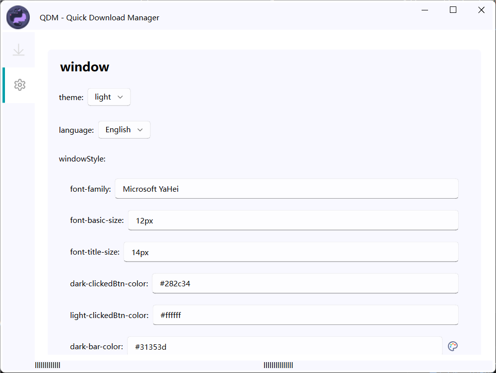
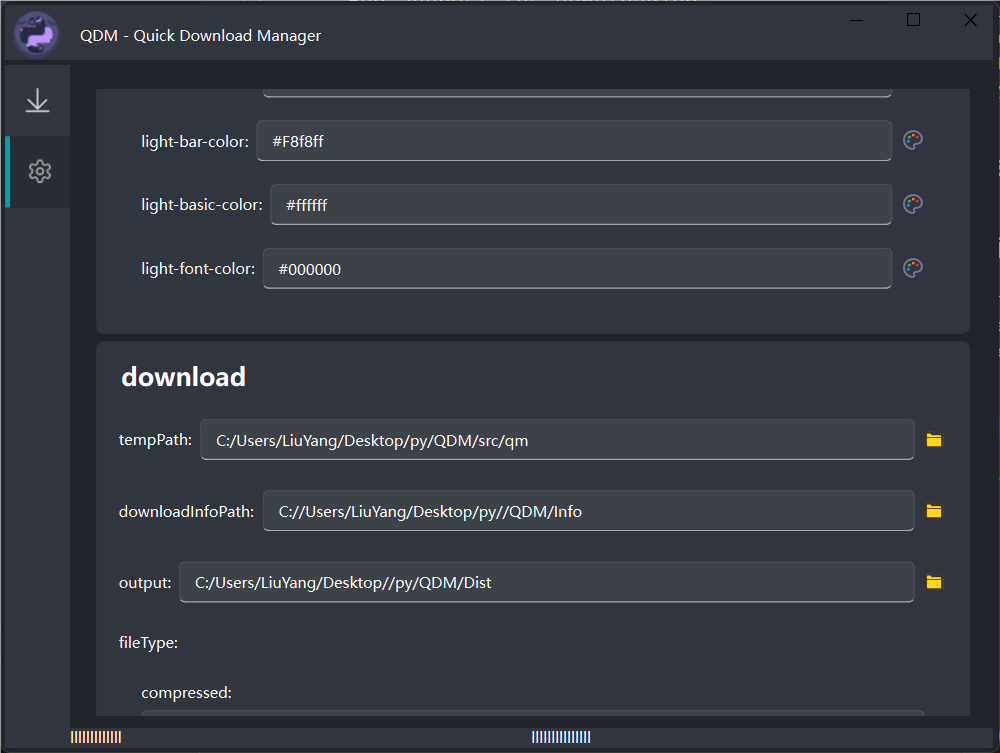
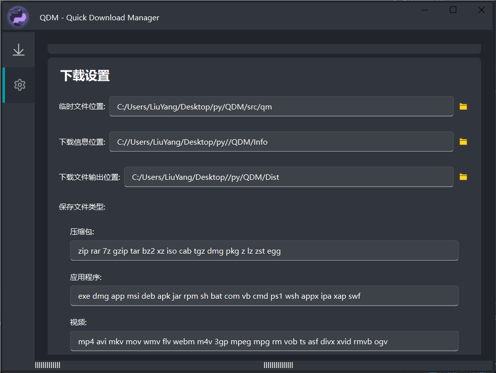

[简体中文](README_CN.md)

# QDM - Quick Download Manager
QDM is a simple, lightweight, and easy-to-use download manager that allows you to download multiple files at once. It is designed to be fast, efficient, and easy to use.
It is written in Python and uses the PySide6 library for its GUI. It is currently in development and is not yet ready for use.（AI Produce）

## Already
- Download files from URLs
- Powerful setup system
- Beautiful UI

## Future
- Add support for downloading from torrents
- Add more UI
- Add Multithreaded download
- Add System tray settings

## Snapshot

## Requirements
- Python 3.10+
- PySide6
- Requests

## Installation
NO PACING YET

## Author
高一
