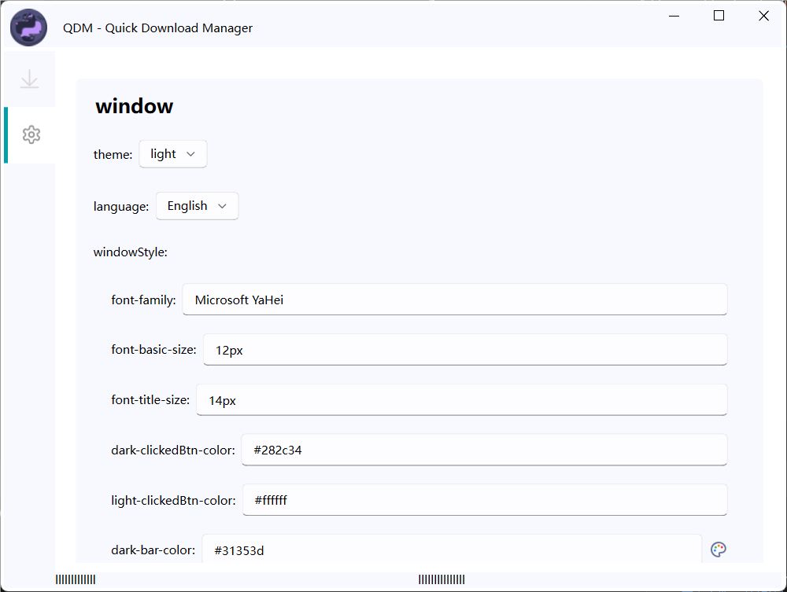
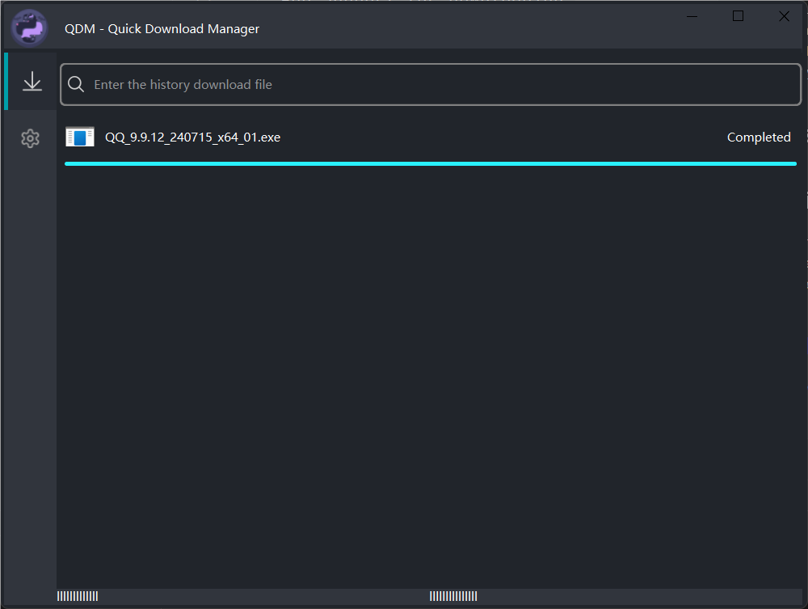
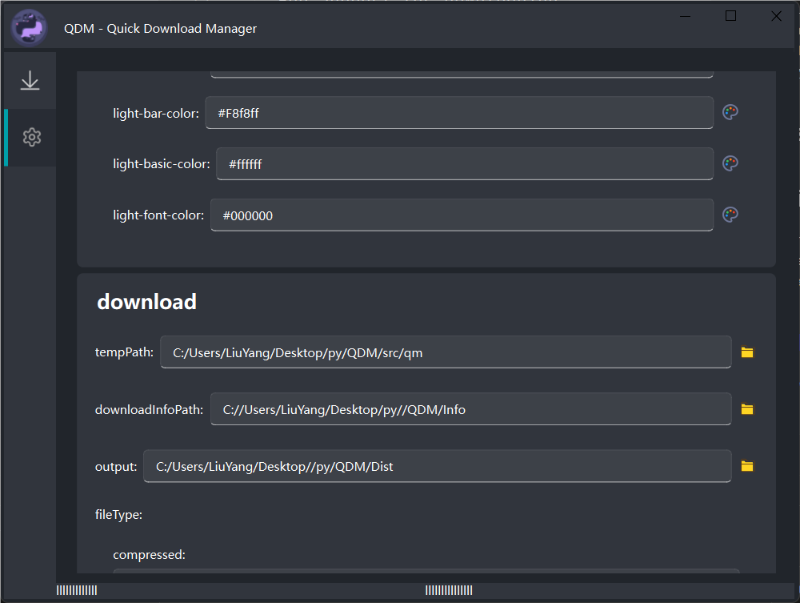
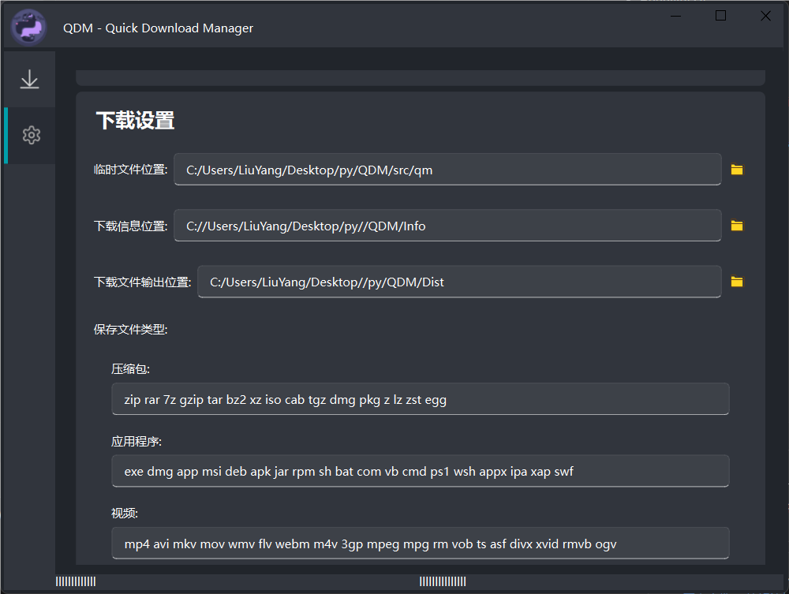

# QDM - 快速下载管理器
QDM 是一个简单、轻量级且易于使用的下载管理器，允许您一次下载多个文件。它旨在快速、高效且易于使用。
它是用 Python 编写的，并使用 PySide6 库作为其 GUI。它目前正在开发中，尚未准备好使用。(Ai 编写)

## 已完成
- 从 URL 下载文件
- 强大的设置系统
- 漂亮的用户界面

## 未来
- 增加对从种子下载的支持
- 添加更多用户界面
- 添加多线程下载
- 添加系统托盘设置

## 截图

## 需求
- Python 3.10+
- PySide6的
-请求

## 安装
尚无安装包

## 作者
高一
